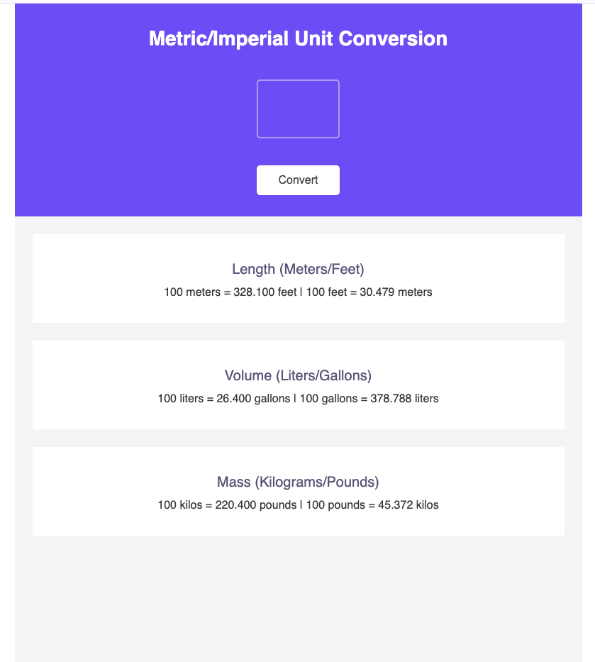

# Getting Started

Install the dependencies and run the project

```
npm install
npm start
```

## About the App

[Metric/Imperial Unit Conversion App](https://emlopezdev.github.io/Unit-Converter/)

A simple app where you can convert multiple types of units from metric to imperial measurments.
If you are tired of looking around the web and finding individual conversion this is a one for all.


